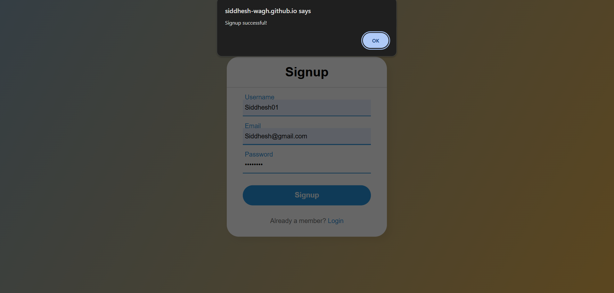

# login-form

A login and signup page built using HTML, CSS, and JavaScript. It features form validations, user authentication using LocalStorage, and a responsive UI. Ideal for beginners learning frontend development.

---

# My Project

Screenshots of the project:

  
  
  
  


---

## ✨ Features

- Styled login and signup pages
- LocalStorage-based authentication (no backend required)
- Real-time form validation
- Forgot password simulation (modal-based reset flow)
- Responsive UI using pure HTML/CSS
- Beginner-friendly code structure

---

## ✅ Validation Rules

### 🔐 Username
- Must contain **at least one uppercase letter**
- Must contain **at least one lowercase letter**
- Must contain **at least one numeric digit**
- Must not exceed **12 characters**

**Regex Used:**
```js
/^(?=.*[a-z])(?=.*[A-Z])(?=.*\d)[A-Za-z\d]{1,12}$/
```

### 🔑 Password
- Must be **8 to 12 characters long**
- Must include:
  - At least one uppercase letter
  - At least one lowercase letter
  - At least one numeric digit
  - At least one special character (e.g., `!@#$%^&*()`)

**Regex Used:**
```js
/^(?=.*[a-z])(?=.*[A-Z])(?=.*\d)(?=.*[\W_]).{8,12}$/
```

---

## 📃 How User Data is Stored (LocalStorage)

- When a user signs up, their credentials are stored in `localStorage` in JSON format.
- Example:

```json
{
  "username": "Siddhesh01",
  "email": "sid@example.com",
  "password": "Sid@1234"
}
```

- Login checks these credentials against the stored data.
- No backend or database is required.

---

## 📦 Steps to Run HTML and CSS Files in Visual Studio Code (VS Code)

### Prerequisites

- [Visual Studio Code](https://code.visualstudio.com/download)
- A modern web browser

### Step 1: Install VS Code

1. Download from [here](https://code.visualstudio.com/download)
2. Install based on your OS

### Step 2: Install Live Server Extension

1. Open VS Code
2. Press `Ctrl + Shift + X`
3. Search for **Live Server**
4. Click `Install` on the extension by Ritwick Dey

### Step 3: Clone the Repository

```bash
git clone https://github.com/siddhesh-wagh/login-form.git
cd login-form
```

### Step 4: Open the Folder in VS Code

```bash
code .
```

### Step 5: Open HTML File

1. In the Explorer panel, find `index.html`
2. Click to open it

### Step 6: Run with Live Server

- Right-click inside the HTML file → **Open with Live Server**
- Or click **Go Live** at the bottom right

### Step 7: Stop Live Server

- Click the **Port: 5500** button
- Or close the terminal

---

## 🧰 Optional: View Without Live Server

- Double-click `index.html` from your file explorer

---

## 🛠️ Troubleshooting

- Live Server doesn't auto open?
  - Check if file is saved
  - Reload VS Code window
  - Restart Live Server

---

Enjoy coding! 🚀


